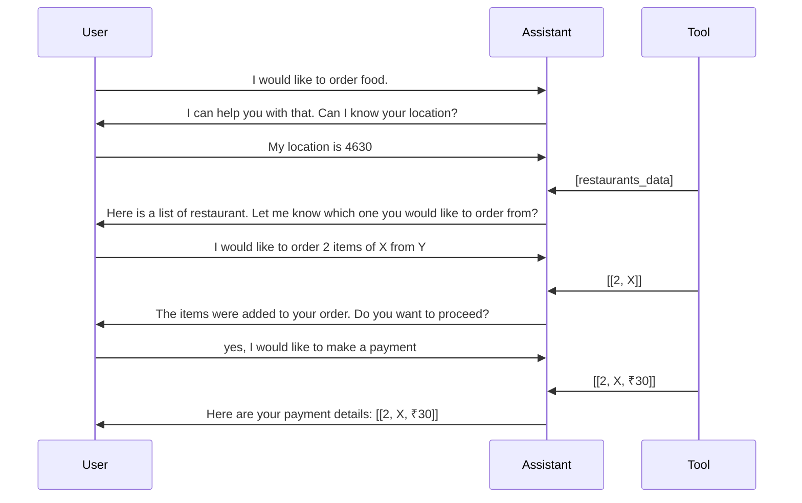

# ManagaPays
This is a payments AI app that provides access to multiple services like food delivery, grocery delivery, travel booking, recurring bill payments on a single platform. 

It is built using an event-driven multiagent framework, autogen. The application backend is built in python and frontend is created using streamlit.

### Set Up
**Step1 :** Set the OpenAI API key

`cmd>>set OPENAI_API_KEY=your-api-key`

**Step2 :** Install all required packages

`cmd>>pip install -r requirements.txt`

**Step3 :** Run the following command on the command prompt and the app opens in your browser.

  `cmd>>Streamlit run app.py`

### Multi-Agent Design
**Agents**
Multiple agents handle customer queries for various services:
- Restaurant Services - FoodDeliveryAgent
- Consumer Goods Services - GroceryDeliveryAgent
- Travel Services - TravelBookingAgent
- Payment service - PaymentCalculatorAgent

The orchestrator agent manages the conversation flow between the User and other services.

### Implementing GuardRails
App needed to be safeguarded against various errors in **1) Intent Classification** a rule based classifier was implemented to detect the intent manually and provide correct orchestration. **2) Missing Function Calls**  retry with the updated prompts or retry with feedback on incorrect/missing calls was implemented. **3) Incorrect Function Parameters** these were handled by incorporating rules within prompts. We also fine-grained and tuned the parameter typing to include all support all the types available to choose on each call. 

### Benchmark
Restaurant service dataset was created. Around 10 different user instructions along with multi steps to evalluate multiagent workflow was constructed. The user proxy agent follows these instructions to generate user responses.

| Dataset                | Tasks      | Accuracy |
|------------------------|------------|----------|
|Restaurant Service      |   10       |  10/10   |
|Consumer Goods Service  |   10       |          |
|Travel Service          |   10       |          |

